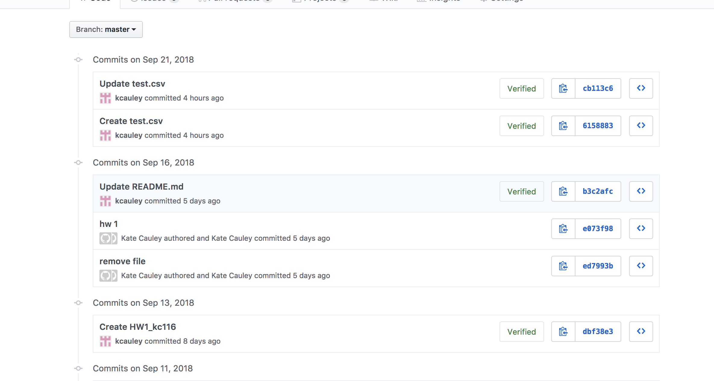
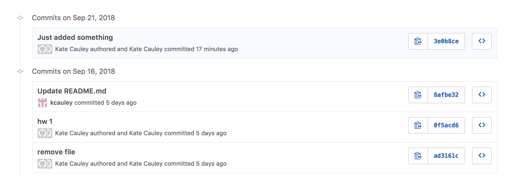

For the homework I attended office hours with I. Habeeb, worked with classmates A. Kasem and S. Aita, and received tutoring from a hired tutor.

 # Part 1  

Here are the screen shots...

Before:

After:

# Part 2

Here is a link to the ipy notebook

https://jupyterlab.cusp.adrf.cloud/user/kc116/lab/tree/PUIdata%2FHW3_KC116.ipynb

**I just realized this link won't work for you so I'm adding screenshots (9/30/18)**

# Part 3 & 4

Please see show_bus_locations_KC116.py in the HW3_KC116 folder.
